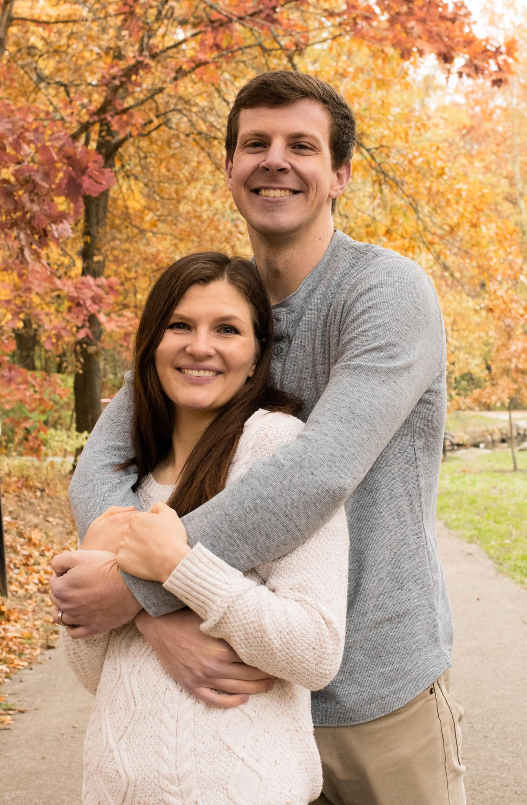

I was born in Carbondale, IL but grew up primarily in Provo, UT. After obtaining a master's degree in statistics from Brigham Young University, I moved to St. Louis, where I obtained my MD and began residency training. I currently am a radiation oncology resident at Washington University School of Medicine / Barnes-Jewish Hospital.

I was blessed to marry my wonderful wife in 2014, and we've since added three darling children to our family. Most of my time outside of work is making memories with them. Other hobbies include cycling, tennis (Vamos Rafa!), hiking, camping, and 4-wheeling.

Research interests revolve around health and public policies that can improve cancer outcomes and cancer equity. If you want to collaborate and/or just be friends, please reach out!

